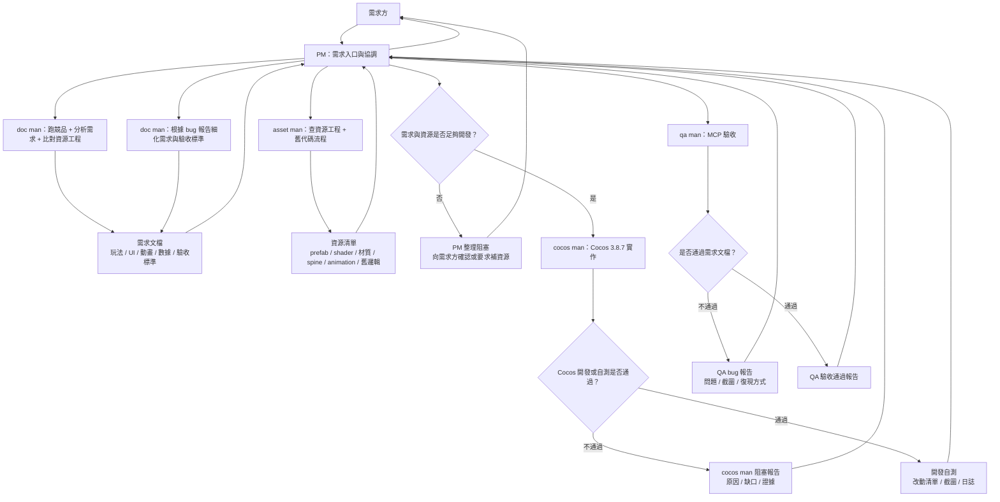
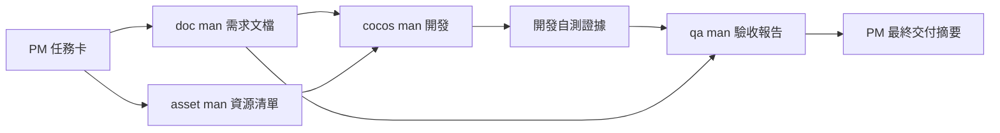
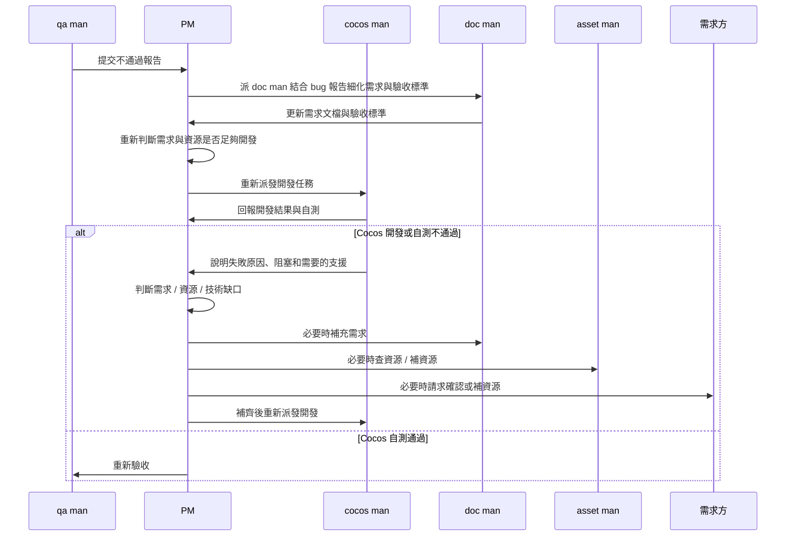

# Slot 遊戲多 Agent 協作流程

## 目標

本文定義一套面向 Slot 遊戲還原與 Cocos Creator 3.8.7 開發的多 Agent 協作流程。核心目標是把「競品效果」、「資源工程真相」、「Cocos 實作」和「MCP 驗收」拆開處理，再由 PM 統一協調，降低誤判、返工和人工溝通成本。

適用場景：

- 跑競品並還原 UI、轉盤、動畫、Payout、BigWin、FreeGame 等效果。
- 從資源工程查 prefab、spine、atlas、shader、材質、動畫和舊代碼流程。
- 在 `games/yjzr` 或其他 Cocos Creator 3.8.7 遊戲工程中落地開發。
- 使用 Funplay Cocos MCP 驗收實際遊戲畫面、控制台報錯和運行狀態。

## 常用目錄與概念

詳細規則見 `.codex/references/workflow-concepts.md`。

| 概念 | 路徑 | 用途 |
| --- | --- | --- |
| Codex 配置目錄 | `E:\CCCCCC\slot-fe-client\.codex` | Codex 的項目級配置、skills、agents、hooks、references。 |
| 輸出文檔目錄 | `E:\CCCCCC\slot-fe-client\docs` | 需求、分析、QA、流程等輸出文檔；按較粗粒度分類建文件夾。 |
| 資源項目 | `E:\CCCCCC\UIProj\387Proj\NewProject` | 反編譯競品的資源和代碼，doc man / asset man 優先作為參考。 |
| 項目根目錄 | `E:\CCCCCC\slot-fe-client` | Slot FE Client 倉庫根目錄。 |
| 遊戲實例目錄 | `E:\CCCCCC\slot-fe-client\games` | 各遊戲實例；目前在研重點是 `yjzr`，其餘已開發項目可作參考。 |

MCP 端口約定：`yjzr:30001`，`yjzr-01:30002`，後續依序遞增。如果遇到不符合的項目，確認目標後修改該項目的 MCP 配置並重新驗證。

## 唤醒方式与停止条件

只写 `@pm-agent` 通常只表示加载 PM 角色或技能，不一定等于启动完整多 Agent 闭环。日常任务建议使用短句唤醒，缺省字段由 `.codex/agent-team.yaml` 的 `workflow_defaults` 自动补齐：

```text
@pm-agent 启动 工作流：修复 xxx 问题
```

默认补齐规则：

| 字段 | 默认来源 |
| --- | --- |
| 项目 | `.codex/agent-team.yaml.workflow_defaults.default_project`，默认 `games/yjzr` |
| 允许调度 agent | `.codex/agent-team.yaml.workflow_defaults.allowed_dispatch_agents` |
| 参考资料 / 项目基础信息 / 竞品链接 | `.codex/agent-team.yaml.workflow_defaults.reference_materials` |
| 期望交付 | `.codex/agent-team.yaml.workflow_defaults.expected_delivery` |
| 停止条件 | `.codex/agent-team.yaml.workflow_defaults.default_stop_conditions` |

需求方当前消息中明确写出的字段优先级最高，会覆盖默认值。只有目标本身不清楚，或默认值会造成产品、资源、排期、权限、实现风险时，PM 才需要反问。

需要覆盖默认值时，可以使用完整写法：

```text
@pm-agent 启动 工作流：
目标：修复 xxx 问题
项目：games/yjzr-01
参考资料 / 效果图 / 竞品链接：xxx
期望交付：代码修复 + MCP 验收截图/日志 + QA 结论
```

PM 被这样唤醒后，不应停在计划、分析或单次失败结论。PM 必须继续推进下一阶段，直到满足以下停止条件之一：

- QA 明确通过，并带有截图、日志、MCP 状态或其他验收证据。
- 需求方明确接受降级、延期或只交付文档/分析，不继续修复。
- 存在真实阻塞，例如缺资源、缺权限、MCP/编辑器不可用、需求冲突无法自行决策；PM 必须给出阻塞证据、所需输入和下一步恢复方式。

如果当前 Codex 环境支持子 Agent 调度工具，PM 可把上述唤醒视为用户授权调度子 Agent；如果当前环境不支持，则 PM 需要在主会话中按角色顺序执行同一流程，不能因为无法 spawn 子 Agent 就提前停止。

## Agent 角色

| Agent | 定位 | 核心職責 | 主要交付物 |
| --- | --- | --- | --- |
| PM | 對接與協調者 | 直接跟需求方對接，拆任務，定優先級，整合 doc man / asset man / cocos man / qa man 的輸出，決定是否進入下一階段 | 任務卡、階段結論、阻塞清單、最終交付摘要 |
| git-agent | Git 操作者 | 負責 Git 修改操作，包括 branch、stash、rebase、merge、stage、commit、tag、push；簡單只讀 Git 查詢可走最快路徑 | Git 操作計劃、提交/標籤、分支狀態、風險說明 |
| doc man | 需求分析者 | 跑競品，同時比對資源工程與舊邏輯，提取玩法、UI、動畫、數據、交互規則，力求產出準確需求文檔 | 需求文檔、競品截圖/視頻、流程圖、驗收標準、疑問清單 |
| asset man | 資源工程管理者 | 查閱資源工程、prefab、材質、shader、動畫、spine、atlas、音效和舊代碼流程，整理可用資源與缺失資源 | 資源清單、缺失資源表、shader/材質對照、舊代碼調用鏈、接入建議 |
| cocos man | Cocos 開發者 | 根據 PM 任務卡、doc 文檔和 asset 清單，在 Cocos Creator 3.8.7 工程中實際開發；確認資源齊全後，到資源工程使用 Cocos 資源 export/import 流程導入目標工程 | 代碼改動、prefab/scene 接入、資源導入、資源綁定、自測截圖、變更說明 |
| qa man | 驗收者 | 待 cocos man 開發完成後，通過 MCP 跑 Cocos Creator 遊戲，根據需求文檔驗收結果 | QA 報告、截圖對比、bug list、pass/fail 結論 |

## 總流程圖



## 階段門禁

| 階段 | 負責 Agent | 進入條件 | 退出條件 |
| --- | --- | --- | --- |
| 需求入口 | PM | 需求方提出方向或問題 | PM 形成任務卡，明確目標、範圍和優先級 |
| 需求分析 | doc man | PM 發出任務卡 | 產出可驗收的需求文檔、競品證據和疑問清單 |
| 資源分析 | asset man | PM 發出任務卡 | 產出資源清單、缺失資源、舊邏輯流程和接入建議 |
| 開發準備 | PM | doc man 和 asset man 均完成首版輸出 | PM 判斷需求與資源足夠開發，或回到需求方確認 |
| Cocos 開發 | cocos man | PM 發出開發任務，且資源清單已確認可用或缺失項已被 PM 接受 | 完成 Cocos export/import 資源導入、代碼/prefab/scene/資源接入，附自測證據 |
| MCP 驗收 | qa man | cocos man 宣告完成 | 給出通過或不通過結論，附截圖/日誌/復現步驟 |
| 最終交付 | PM | QA 通過 | PM 統一向需求方彙報結果、風險和後續建議 |

## 任務流轉規則

| 規則 | 說明 |
| --- | --- |
| PM 是唯一對外窗口 | 需求方只和 PM 對接，避免多個 agent 同時打擾需求方 |
| doc man 不直接開發 | doc man 可以讀代碼和資源，但不直接改遊戲工程 |
| asset man 不替代需求判斷 | asset man 提供資源真相和舊邏輯，最終需求仍以 PM 整合後的任務卡為準 |
| cocos man 不手工亂拷資源 | cocos man 在確認資源齊全後，應到資源工程使用 Cocos 資源 export/import 流程導入資源，避免 meta、UUID、材質、shader、prefab 關聯丟失 |
| cocos man 不擅自改需求 | 如果發現文檔與資源衝突，先回報 PM，不自行改產品規則 |
| qa man 不直接修 bug | QA 只做驗收和復現，除非 PM 明確指派修復任務 |
| Git 修改交給 git-agent | branch、stash、rebase、merge、stage、commit、tag、push 等修改操作優先交給 git-agent；簡單只讀 Git 查詢可選最快方式 |
| 每一輪都要有證據 | 需求、資源、開發、自測、驗收都必須有文檔、截圖、日誌或代碼路徑 |
| 驗收標準前置 | 沒有明確驗收標準，不應進入 Cocos 開發階段 |

## 節點失敗回退規則

| 失敗節點 | 觸發條件 | 回退路徑 | 重新進入條件 |
| --- | --- | --- | --- |
| qa man | QA 驗收不通過，產出 bug 報告 | qa man 將 bug 報告、截圖、日誌、復現步驟交給 PM；PM 派 doc man 結合 bug 報告細化需求與驗收標準；PM 重新做開發門禁後派 cocos man 開發 | doc man 已更新需求文檔和驗收標準，PM 確認可重新開發 |
| cocos man | Cocos 開發或自測不通過，無法宣告完成 | cocos man 向 PM 說明失敗原因、阻塞、需要的需求/資源/技術支援和證據；PM 調度 doc man / asset man / 資源後重新派發 cocos man 開發 | PM 已補齊需求、資源或支援決策，並重新下發開發任務 |

## 交付物關係圖



## PM 任務卡模板

```text
任務名稱：
背景：
目標：
優先級：
涉及遊戲：
參考競品：
參考資源工程：

必須符合：
不處理範圍：
驗收方式：

交給 doc man 的問題：
交給 asset man 的問題：
交給 cocos man 的開發範圍：
交給 qa man 的驗收範圍：

已知風險：
需要需求方確認：
```

## doc man 輸出模板

```text
文檔名稱：
競品來源：
測試環境：
截圖 / 視頻路徑：

目標效果：
交互流程：
狀態機：
數據來源：
動畫時序：
UI 佈局：
邊界情況：

與資源工程對照：
可直接復用的資源：
疑似缺失的資源：
與舊代碼不一致處：

驗收標準：
待 PM / 需求方確認：
```

## asset man 輸出模板

```text
資源工程路徑：
目標遊戲工程路徑：

資源分類：
prefab：
spine：
atlas / spriteFrame：
animation：
material：
shader：
audio：
script：

舊代碼流程：
入口：
控制器：
關鍵方法：
事件時序：
數據結構：

可直接接入：
需要轉換：
缺失資源：
高風險資源：

建議接入方式：
```

## cocos man 輸出模板

```text
開發任務：
依據文檔：
依據資源清單：

資源確認：
資源工程路徑：
導入方式：
導入資源清單：

改動文件：
新增文件：
刪除文件：

實作說明：
prefab / scene 綁定：
資源引用：
兼容處理：

自測方式：
MCP 連接結果：
截圖路徑：
控制台 / 日誌結果：

未完成或阻塞：
```

## qa man 輸出模板

```text
驗收任務：
依據需求文檔：
依據開發改動：

MCP 連接結果：
測試場景：
操作步驟：
截圖 / 視頻：
控制台 / 日誌：

通過項：
不通過項：
問題等級：
復現方式：
期望結果：
實際結果：

結論：
是否允許交付：
```

## 返工閉環



## 常見風險與對策

| 風險 | 表現 | 對策 |
| --- | --- | --- |
| 競品觀察不完整 | 只截到 idle，缺少中獎、消除、BigWin 等狀態 | doc man 必須標注觀察覆蓋率和未覆蓋狀態 |
| 資源工程與競品不一致 | 競品有效果，但資源工程沒有對應 prefab 或 shader | asset man 產出缺失資源表，PM 決定補資源或降級 |
| Cocos prefab 綁定錯誤 | 編輯器無報錯但運行時節點空、效果不出現 | cocos man 需用 MCP 驗證 runtime 節點與 console |
| QA 標準漂移 | qa man 按個人理解驗收，而非按文檔 | QA 報告必須引用需求文檔章節或截圖 |
| PM 合併信息不足 | doc、asset、dev 結論互相矛盾 | PM 必須先做衝突整理，再決定是否開發或返工 |
| 多 agent 同時改同一處 | prefab、scene 或核心控制器衝突 | PM 明確文件所有權，避免重疊寫入 |

## 建議的工作節奏

| 節奏 | 動作 |
| --- | --- |
| 第 1 輪 | PM 建任務卡，doc man 和 asset man 並行分析 |
| 第 2 輪 | PM 整合需求文檔與資源清單，確認是否可開發 |
| 第 3 輪 | cocos man 開發，完成後提交自測證據 |
| 第 4 輪 | qa man MCP 驗收，產出 pass/fail |
| 第 5 輪 | PM 根據 QA 結論交付或派發返工 |

## 最小可行版本

如果任務較小，可以簡化為：

```text
PM 任務卡
doc man 簡短需求 + asset man 簡短資源確認
cocos man 實作
qa man MCP 截圖驗收
PM 彙報
```

不可省略的是：

- PM 任務卡。
- 至少一份目標效果證據。
- 至少一份資源或代碼依據。
- cocos man 自測結果。
- qa man 驗收結論。

## 後續可演進方向

| 方向 | 說明 |
| --- | --- |
| Agent Prompt 固化 | 把本文拆成 PM、doc man、asset man、cocos man、qa man 的獨立 system prompt |
| 文檔模板自動生成 | PM 建任務卡後，自動生成 doc/asset/qa 模板 |
| MCP 驗收標準化 | qa man 固定輸出 screenshot、console log、runtime node state |
| 資源索引庫 | asset man 維護 prefab、shader、material、spine、animation 的可搜索索引 |
| 任務看板化 | 每個任務有狀態：需求中、資源確認中、開發中、驗收中、返工中、已交付 |
