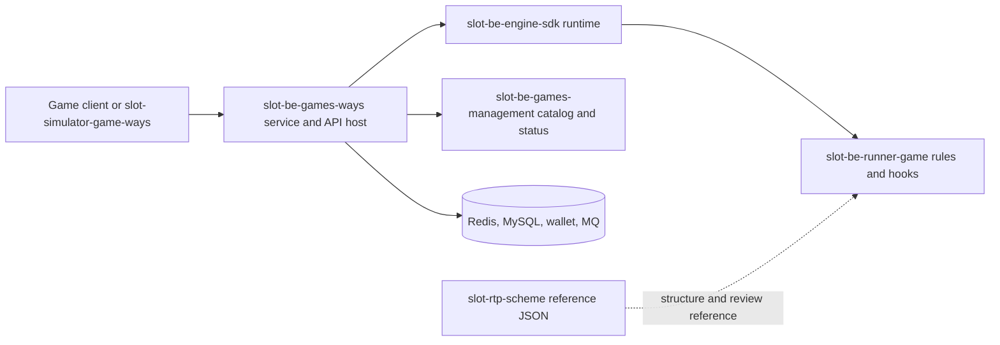

# Server toolchain quick reference

Use this reference after resolving `<server-root>` to
`<slot-fe-client-root>/games/Server`. It is a routing guide for locating the owner of server
behavior. It does not prove a target game's rules, protocol, math, or deployed version.

The repository roles and GitHub addresses below were verified on 2026-09-07 from the local
README/source/manifests and each checkout's `origin`. Re-read the current repository before use;
the local checkout may be ahead, behind, dirty, or bound to a different module version.

## Architecture at a glance



The usual request path is
`client/simulator -> slot-be-games-ways -> slot-be-engine-sdk -> target runner`.
`slot-be-games-management` and infrastructure services support the host.
`slot-rtp-scheme` is reference data, not a runtime package.

## Selection table

| Need | Inspect first | Typical owner |
|---|---|---|
| One game's symbols, awards, board, feature state, Free Game, response `d`, or deterministic seeds | `slot-be-runner-{game}` | Target runner |
| Shared Spin/Layout lifecycle, Ways/Lines/Cluster detection, RNG, animation queue, retry, RTP manager, seed library, wallet settlement | `slot-be-engine-sdk` | Engine SDK |
| REST/gRPC routes, DI/config boot, Spin/Buy/lastSpin/bets/schemes endpoints, debug endpoints, simulation queue/service integration | `slot-be-games-ways` | Ways service host |
| Game catalog lookup, enable/disable status, game metadata cache | `slot-be-games-management` | Games management service |
| Trial/formal scheme JSON lookup or structural comparison | `slot-rtp-scheme` | Scheme data repository; normally read-only |
| Render real response frames, replay `previous_frame_id`, inspect game-specific detail fields | `slot-simulator-game-ways` | Simulator UI |

## Shared repositories

### `slot-be-engine-sdk`

- Local path: `<server-root>/slot-be-engine-sdk`
- GitHub: [jp-sunshine/slot-be-engine-sdk](https://github.com/jp-sunshine/slot-be-engine-sdk)
- Type: Go library; it is not a standalone game service.
- Function: defines `SlotGameRunner`, `SlotGameInfo`, `BaseGame`, Spin/Layout execution,
  default Ways/Lines/Cluster award detection, symbol fill/fall/elimination hooks, deterministic
  seed/RNG behavior, animation queue and frame retry, maximum-win handling, wallet/result
  settlement integration, RTP managers, seed storage, and simulation-facing result types.
- Key locations: `v4/runner_interface.go`, `v4/runner_default_base.go`,
  `v4/runner_default_ways.go`, `v4/runner_default_line.go`,
  `v4/runner_default_cluster.go`, `v4/engine.go`, `v4/animation_queue.go`, and `v4/rtp/`.
- Use it when behavior is shared across runners or when a runner override depends on lifecycle
  ordering. Keep a game-specific mechanic in the runner unless the requirement is genuinely
  platform-wide.

### `slot-be-games-ways`

- Local path: `<server-root>/slot-be-games-ways`
- GitHub: [jp-sunshine/slot-be-games-ways](https://github.com/jp-sunshine/slot-be-games-ways)
- Type: Go service shell and importable boot library. Its own `cmd/main.go` starts with no
  registered games; a runner normally imports `boot` and calls `boot.Run(...)`.
- Function: owns dependency injection, configuration/secrets, logging, MySQL/Redis wiring,
  the games-management gRPC client, HTTP/gRPC startup, and the shared game-center service.
  Public routes include health, Spin, lastSpin, Buy when supported, bets, and schemes. Debug
  mode adds cheat/RTP/seed-library endpoints; simulation mode adds submission, stop, progress,
  and download endpoints.
- Key locations: `boot/boot.go`, `internal/rest/router.go`, `internal/rest/handler*.go`,
  `internal/services/`, `internal/repository/`, `internal/config/`, `API_SCHEME.md`, and
  `API_SIMULATION.md`.
- Use it for transport, service orchestration, shared request handling, persistence, or
  simulation-service behavior. Game-specific layout and payout logic does not belong here.
- Caution: `sdk.md` documents an older v3 interface. For current runner work, prefer the
  runner's `go.mod` and the matching `slot-be-engine-sdk/v4` source.

### `slot-be-games-management`

- Local path: `<server-root>/slot-be-games-management`
- GitHub: [jp-sunshine/slot-be-games-management](https://github.com/jp-sunshine/slot-be-games-management)
- Type: standalone Go gRPC microservice.
- Function: provides game catalog and status management through `GetGameByGameCode`,
  `GetGames`, and `UpdateGameStatus`; persists through MySQL and caches per game in Redis.
- Key locations: `cmd/`, `internal/grpc/`, `internal/services/`, `internal/repository/`,
  `database/schema/`, and `etc/application.yaml`.
- Use it when registration, catalog lookup, availability/status, or management caching is in
  scope. Do not place Spin mechanics or runner response fields here.

### `slot-rtp-scheme`

- Local path: `<server-root>/slot-rtp-scheme`
- GitHub: [jp-sunshine/slot-rtp-scheme](https://github.com/jp-sunshine/slot-rtp-scheme)
- Type: versioned JSON data/reference repository; it has no Go or Node runtime.
- Function: stores game RTP/scheme documents under `试玩版json/` and `正式版json/`, with
  supporting notes under `文档说明/`.
- Use it to locate the exact `{GAME_CODE}_*_试玩版.json` structural reference required by
  the `s-ser` trial-scheme Gate. The selected JSON can constrain shape but does not by itself
  prove weights, RTP, deployed values, or target-game semantics.
- Keep it read-only except for the controlled clean-worktree fast-forward expressly required
  by the trial-scheme Gate. Never create a missing reference or substitute another game.

### `slot-simulator-game-ways`

- Local path: `<server-root>/slot-simulator-game-ways`
- GitHub: [jp-sunshine/slot-simulator-game-ways](https://github.com/jp-sunshine/slot-simulator-game-ways)
- Type: Vue 3/Vite developer UI.
- Function: calls runner REST endpoints, sends game code/bet/seed/`previous_frame_id`, groups
  returned frames into Spins, renders layouts and game-specific detail fields, exercises resume
  behavior, and provides a client-facing contract surface for deterministic verification.
- Key locations: `_GUIDE_NEW_GAME.md`, `src/views/{game}/`, `src/router/index.js`,
  `src/App.vue`, `src/api/axios.js`, `src/utils/spinGrouping.js`, and `vite.config.js`.
- Normal commands: `npm install`, `npm run dev`, and `npm run build`; choose an isolated local
  port and proxy target under the `s-ser` coexistence Gate.
- Use it for response-consumer and visual/frame verification. It is not the mathematical
  simulation engine and does not replace unit tests, raw-response capture, or RTP sign-off.

## Game runner repositories

`slot-be-runner-{game}` is the default owner of a single game's executable composition root,
identity/route registration, `SlotGameInfo`, chance parsing, lifecycle overrides, special
state, response detail mapping, `scheme.json`, tests, runtime config, packaging, and workflow.
A current v4 runner typically imports both `slot-be-engine-sdk/v4` and
`slot-be-games-ways/boot`, then registers its constructor in `cmd/main.go`.

GitHub naming pattern: `https://github.com/jp-sunshine/slot-be-runner-{game}`. Locally observed
examples are:

| Local repository | GitHub |
|---|---|
| `slot-be-runner-bsrqq` | [jp-sunshine/slot-be-runner-bsrqq](https://github.com/jp-sunshine/slot-be-runner-bsrqq) |
| `slot-be-runner-flp` | [jp-sunshine/slot-be-runner-flp](https://github.com/jp-sunshine/slot-be-runner-flp) |
| `slot-be-runner-fzdmx` | [jp-sunshine/slot-be-runner-fzdmx](https://github.com/jp-sunshine/slot-be-runner-fzdmx) |
| `slot-be-runner-hgcs` | [jp-sunshine/slot-be-runner-hgcs](https://github.com/jp-sunshine/slot-be-runner-hgcs) |
| `slot-be-runner-jdsry` | [jp-sunshine/slot-be-runner-jdsry](https://github.com/jp-sunshine/slot-be-runner-jdsry) |
| `slot-be-runner-pkwg` | [jp-sunshine/slot-be-runner-pkwg](https://github.com/jp-sunshine/slot-be-runner-pkwg) |
| `slot-be-runner-sjzbg` | [jp-sunshine/slot-be-runner-sjzbg](https://github.com/jp-sunshine/slot-be-runner-sjzbg) |

Do not select a sibling runner as authoritative target behavior. It may illustrate an API or
SDK extension pattern only after recording the target evidence and the adaptation difference.

## Start-of-task checks

1. Resolve the exact target runner and read its local instructions, README/spec, `go.mod`,
   `cmd/main.go`, runtime configuration, `scheme.json`, and Git status.
2. Read `go.mod` `require` and `replace` entries and the nearest active `go.work`, if any.
   Record whether the runner consumes tagged modules or a local checkout. Never assume sibling
   source edits are compiled into the runner.
3. Verify each selected repository's origin without fetching or changing it:

   ```powershell
   $env:GIT_OPTIONAL_LOCKS = '0'
   git -C <repository> remote get-url origin
   git -C <repository> status --short --branch
   ```

4. Build an owner map with one row per requested behavior:
   `behavior -> current producer -> current consumer -> owning repository -> permitted write -> verification`.
5. Keep shared repositories read-only unless explicitly in scope. Do not fetch, pull, switch,
   reset, clean, stash, or upgrade dependencies merely to inspect them. Apply the separate
   controlled sync rule when the trial-scheme Gate selects `slot-rtp-scheme`.
6. Exclude `_codex_tmp/`, logs, build output, and unowned experimental directories from the
   toolchain. They are not authoritative source repositories.

## Common routing mistakes

- Editing `slot-be-games-ways` for a single game's symbol or payout rule.
- Duplicating engine queue/RTP logic inside one runner without proving a runner-specific need.
- Treating `slot-simulator-game-ways` rendering as math acceptance.
- Treating `slot-rtp-scheme` values as proof of the currently deployed scheme.
- Reading local SDK/host source while the runner actually consumes a different tagged module.
- Using a sibling runner or an `_codex_tmp` copy as target-game evidence.
